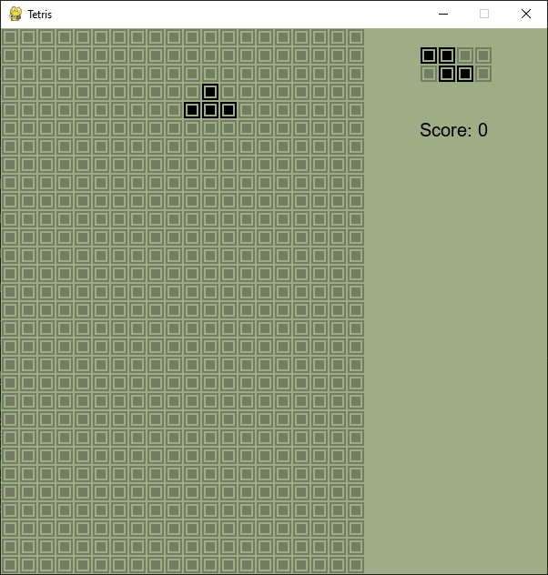

# Tetris Game

My implementation of the classic game of Tetris game on Python with Pygame. Levels not yet working. Also it needs to be multiple keypresses to move the block, i need a way to make the block move while the user is holding the key. And I need to make full line clear animation. 